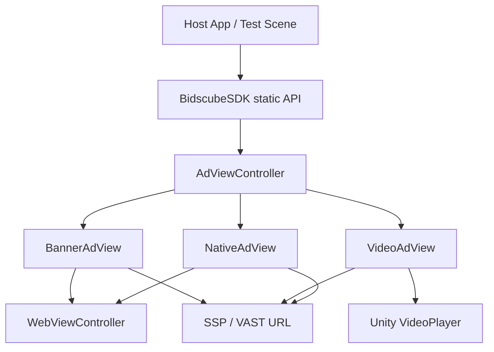

# Архітектура

## Загальна схема



## Шари відповідальності

| Шар | Класи | Роль |
|-----|-------|------|
| **Facade** | `BidscubeSDK` | Публічний API, tracking active ads, parenting, position, consent stubs |
| **Orchestration** | `AdViewController` | Canvas, layout, timeout (non-video), dispatch за `AdType` |
| **Views** | `BannerAdView`, `VideoAdView`, `NativeAdView` | Завантаження markup, рендер, callbacks |
| **WebView** | `WebViewController`, `WebViewObject` | HTML ads, margin sync з RectTransform |
| **Network** | `URLBuilder`, `DeviceInfo`, `AdMarkupExtractor` | URL + parse adm |
| **VAST** | `VASTParser` | XML → video URL, tracking, companion, skipoffset |

## AdViewController — центральний оркестратор

Файл: `Runtime/BidscubeSDK/Controllers/AdViewController.cs`

### Створення

`BidscubeSDK.CreateAdViewController(...)`:

1. Створює GameObject під `SDKContent` або `SetAdViewsParentTransform` override
2. Додає `AdViewController`
3. Викликає `Initialize(placementId, adType, callback, position, videoAdFormat)`
4. Для video — завжди fullscreen root (не slot parent)

### Initialize flow

```
Initialize
  ├── LiteNoVideo guard (video + BIDSCUBE_ANDROID_LITE_NO_VIDEO) → OnAdFailed 1006
  ├── Setup canvas (Overlay) якщо потрібно
  ├── Apply AdPosition layout (Header/Footer/Sidebar/FullScreen/center)
  └── Switch adType:
        Image  → CreateImageAdView()  → BannerAdView.LoadAdFromURL
        Video  → CreateVideoAdView()  → VideoAdView.LoadVideoAdFromURL
        Native → CreateNativeAdView() → NativeAdView.LoadAdFromURL
```

### Position resolution (пріоритет)

1. **Manual** — `BidscubeSDK.SetAdPosition()` (найвищий)
2. **Server** — `SetResponseAdPosition()` з adm response
3. **Default** — `SDKConfig.DefaultAdPosition` або `Unknown`

### Timeout

- **Image / Native:** coroutine timeout з `SDKConfig.DefaultAdTimeoutMs` → `OnAdFailed(TimeoutError)`
- **Video:** timeout controller **не** застосовується (довгий prepare/stream)

### Overlay objects

Inspector field `overlayObjects[]` — prefab-и, що інстанціюються після `MarkAdAsLoaded()` (z-order поверх creative).

## Parenting і embedded slots

```csharp
BidscubeSDK.SetAdViewsParentTransform(slotRectTransform, useLayoutSlotSizing: true);
BidscubeSDK.ReapplyLayoutForAllActiveAds(); // після layout rebuild
```

- **Video** — ignore slot parent, завжди fullscreen hierarchy
- **Banner** — при `useLayoutSlotSizing` HTML layout використовує `flex-start`
- **WebView margins** — `WebViewController.FindBestCanvasFallback()` при зміні canvas

## Banner / Image flow

```
ShowImageAd / GetBannerAdView
  → AdViewController (AdType.Image)
  → BannerAdView
  → URLBuilder (c=b, res=js)
  → HTTP GET
  → IAdRenderOverride? (true → stop)
  → unwrap nested {"adm":"..."} JSON
  → WebViewController loads HTML
  → OnAdLoading → OnAdLoaded → OnAdDisplayed
```

Деталі: [banner-and-webview.md](banner-and-webview.md)

## Video flow

```
ShowInterstitialVideoAd / ShowRewardedVideoAd
  → AdViewController (AdType.Video, VideoAdFormat)
  → VideoAdView.SetPlacementInfo(placementId, callback, format)
  → LoadVideoAdFromURL / LoadVideoAdFromVastXml
  → parse: VAST XML | JSON adm | direct MP4
  → wrapper VAST recursion (max depth 5)
  → VASTParser → MP4 preferred
  → VideoPlayer.Prepare → Play
  → skip UI → complete/skip → ShowEndCard → Close → Dismiss
```

Деталі: [video-ads.md](video-ads.md), [openrtb.md](openrtb.md)

## OpenRTB pod flow (1.2.14)

OpenRTB 2.6 support is response-side podded video parsing only. The SDK still uses the legacy GET ad request flow through `URLBuilder`. `OpenRtbBidRequestBuilder` is a placeholder. Full OpenRTB POST bid requests are not implemented.

```
LoadVideoAdFromURL
  → HTTP GET (legacy URLBuilder — unchanged)
  → VideoAdPayloadResolver.Resolve(body, SDKConfig)
      → OpenRtbJson.TryParseObject
      → OpenRtbPoddedResponseNormalizer.Normalize
      → PoddedPlaybackPlanBuilder.Build
  → LoadPlaybackPlanCoroutine(plan)
      → for each slot: LoadPlaybackSlotCoroutine
          → VastXml | VastAdTagUrl fetch | DirectVideoUrl | adm fallback
          → VASTParser → VideoPlayer
      → on slot complete: TryAdvanceToNextPlaybackSlot
  → OnVideoAdCompleted / OnUserRewarded after LAST slot
```

## Native flow

```
ShowNativeAd
  → NativeAdView
  → URLBuilder (c=n, res=json)
  → parse OpenRTB native JSON або HTML adm
  → default: WebView HTML template (_useWebViewRendering = true)
  → fallback: Unity UI (Image, Text, Button)
```

Деталі: [native-ads.md](native-ads.md)

## IAdRenderOverride hook

Перед default render у `BannerAdView`, `VideoAdView`, `NativeAdView`:

```csharp
if (callback is IAdRenderOverride o &&
    o.OnAdRenderOverride(placementId, adm, adType, position))
    return; // SDK не рендерить
```

`adm` може бути HTML fragment, full document або JSON string.

## Tracking active instances

`BidscubeSDK` тримає:

- `_activeControllers` — `List<AdViewController>`
- `_activeBanners` — `List<BannerAdView>`

`ClearAllAds()` / `RemoveAllBanners()` — destroy + untrack.

## Debug telemetry

`AgentNdjsonDebugLog` — internal NDJSON logs у select paths (URL build, VAST parse fail). Не публічний API.

## Що **не** в core SDK

- Frequency capping interstitial — відповідальність host app
- CMP / GDPR UI — consent API stubbed (див. [known-issues.md](known-issues.md))
- Mediation waterfall — adapter packages
- IMA production path — disabled (`_useIMA = false`)
