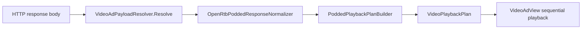

# OpenRTB 2.6 — podded video (response-side)

> **Версія:** 1.2.14  
> **Namespace:** `BidscubeSDK.OpenRTB` (internal)  
> **Публічна конфігурація:** `SDKConfig` (enums + builder methods)

OpenRTB 2.6 support is response-side podded video parsing only. The SDK still uses the legacy GET ad request flow through `URLBuilder`. `OpenRtbBidRequestBuilder` is a placeholder. Full OpenRTB POST bid requests are not implemented.

Цей модуль парсить **відповідь** SSP (JSON / VAST / URL) у послідовний план відтворення відео-слотів.

---

## Що реалізовано / що ні

| Реалізовано | Не реалізовано |
|-------------|----------------|
| Парсинг `openrtb.video`, `bids[]`, `seatbid[].bid[]`, root `adm` | Full OpenRTB POST bid requests (`OpenRtbBidRequestBuilder` — placeholder) |
| Послідовне відтворення pod slots через `VideoPlayer` | Server-side auction / bidding |
| VAST multi-`<Ad>` split, wrapper recursion | Guaranteed cross-platform HLS/DASH playback |
| VAST ad tag URL fetch + nested JSON plan | Frequency capping |
| Strict/lenient duration validation | |

**Playback path:** custom `VASTParser` + Unity `VideoPlayer` (IMA stubs exist but are disabled).

**Legacy GET flow** (`URLBuilder` → HTTP GET → adm) **не змінений**.

---

## Архітектура модуля



### Файли та відповідальність

| Файл | Клас | Роль |
|------|------|------|
| `OpenRtbPodModels.cs` | DTOs | `OpenRtbPodContext`, `OpenRtbAdMarkup`, `VideoPlaybackSlot`, `VideoPlaybackPlan`, … |
| `OpenRtbJson.cs` | `OpenRtbJson` | Легкий JSON parser; відхиляє trailing garbage після root object |
| `OpenRtbVideoObjectParser.cs` | `OpenRtbVideoObjectParser` | Парсинг `openrtb.video` / root `video` (podid, rqddurs, poddur, …) |
| `OpenRtbPoddedResponseNormalizer.cs` | `OpenRtbPoddedResponseNormalizer` | `seatbid[].bid[]`, `bids[]`, root `adm` → `OpenRtbPoddedResponse` |
| `VastAdSequenceParser.cs` | `VastAdSequenceParser` | Розбиття multi-`<Ad>` VAST на окремі документи |
| `PoddedPlaybackPlanBuilder.cs` | `PoddedPlaybackPlanBuilder` | Побудова `VideoPlaybackPlan` з урахуванням pod type |
| `VideoAdPayloadResolver.cs` | `VideoAdPayloadResolver` | Entry point: raw body → `ResolvedVideoAdPayload` |
| `OpenRtbVideoUrlHelper.cs` | `OpenRtbVideoUrlHelper` | Direct video vs VAST ad tag URL; max redirect depth = **5** |
| `VastAdTagJsonPlanLoader.cs` | `VastAdTagJsonPlanLoader` | Режим завантаження nested JSON plan (single vs full) |
| `OpenRtbBidRequestBuilder.cs` | — | **Placeholder** — POST не реалізовано |
| `AssemblyInfo.cs` | — | `InternalsVisibleTo("BidscubeSDK.OpenRTB.Tests")` |

---

## Підтримувані формати відповіді

### 1. Raw VAST XML

```xml
<VAST version="3.0">...</VAST>
```

→ single slot, `VastXml` на слоті.

### 2. Root ADM + OpenRTB video metadata

```json
{
  "adm": "<VAST>...</VAST>",
  "openrtb": {
    "video": {
      "podid": "pod-1",
      "poddur": 60,
      "rqddurs": [15, 30],
      "maxseq": 3
    }
  }
}
```

→ legacy envelope; працює навіть при `OpenRtbPodMetadataEnabled(false)` для root `adm`.

### 3. Root `bids[]` + OpenRTB video metadata

```json
{
  "openrtb": {
    "video": {
      "podid": "pod-1",
      "poddur": 60,
      "rqddurs": [15, 30],
      "maxseq": 3
    }
  },
  "bids": [
    {
      "adm": "<VAST>...</VAST>",
      "slotinpod": 1,
      "duration": 15
    },
    {
      "adm": "<VAST>...</VAST>",
      "slotinpod": 2,
      "duration": 30
    }
  ]
}
```

### 4. `seatbid[].bid[]` з ext

```json
{
  "seatbid": [
    {
      "bid": [
        {
          "id": "bid-1",
          "adm": "<VAST>...</VAST>",
          "crid": "creative-1",
          "price": 1.2,
          "ext": {
            "slotinpod": 1,
            "duration": 15,
            "podid": "pod-1"
          }
        }
      ]
    }
  ],
  "openrtb": {
    "video": {
      "podid": "pod-1",
      "poddur": 60,
      "rqddurs": [15, 30],
      "maxseq": 3
    }
  }
}
```

При кількох pod groups — вибирається **перший відсортований `podid`**.

### 5. Flat JSON з root `adm` only

```json
{ "adm": "<VAST ...>" }
```

→ single-slot legacy path.

### 6. HTTP URL як adm

| URL тип | Поле слоту | Поведінка |
|---------|------------|-----------|
| Direct media (`.mp4`, `.webm`, `.mov`, `.m3u8`, `.mpd`) | `DirectVideoUrl` | `VideoPlayer.url` — see HLS/DASH caveat below |
| VAST ad tag URL | `VastAdTagUrl` | GET → VAST / JSON / redirect chain |

Класифікація: `OpenRtbVideoUrlHelper.IsLikelyDirectVideoUrl`.

**HLS/DASH note:** `.m3u8` / `.mpd` URLs may be classified as direct video URLs, but Unity `VideoPlayer` support can be platform-dependent and unreliable. Progressive MP4 is preferred.

---

## Pod types

`PoddedPlaybackPlanBuilder.DetectPodType`:

| Type | Умови | Поведінка |
|------|-------|-----------|
| **Single** | 1 markup | Один слот |
| **Structured** | `slotinpod` + `rqddurs` | Сортування за slot; strict перевіряє duration vs rqddurs |
| **Dynamic** | `poddur` budget | Слоти з duration > залишок budget пропускаються |
| **Hybrid** | fixed slots (`slotinpod`) + dynamic fill | Fixed спочатку, потім dynamic; strict: fixed sum > poddur → **null plan** |
| **Unknown** | fallback | Response order |

### Strict hybrid validation (1.2.14+)

```
VideoPodDurationValidationMode == Strict
&& podType == Hybrid
&& poddur задано
&& sum(fixed slot durations) > poddur
→ null plan + log
```

---

## VideoPlaybackSlot

```csharp
internal sealed class VideoPlaybackSlot
{
    public string Adm;           // raw adm fallback
    public string VastXml;       // inline VAST
    public string VastAdTagUrl;  // fetch before play
    public string DirectVideoUrl;// VideoPlayer direct
    public int SlotIndex;
    public int? SlotInPod;
    public int? DurationSeconds;
}
```

### Порядок обробки в `VideoAdView.LoadPlaybackSlotCoroutine`

1. `VastXml` → `VASTParser.Parse` / wrapper fetch
2. `VastAdTagUrl` → `FetchAndLoadVastAdTagUrlCoroutine`
3. `DirectVideoUrl` → `VideoPlayer`
4. `Adm` → VAST detect / URL classify / failure

---

## VAST ad tag URL fetch

`FetchAndLoadVastAdTagUrlCoroutine(url, depth = 0)`:

| Response | Дія |
|----------|-----|
| VAST XML | `LoadInlineVastXmlCoroutine` |
| JSON `{...}` | `VideoAdPayloadResolver.Resolve` |
| JSON → 1 slot | `LoadPlaybackSlotCoroutine` (зберігає outer pod state) |
| JSON → 2+ slots | `LoadPlaybackPlanCoroutine` (nested pod) |
| Direct video URL | `VideoPlayer` |
| Another HTTP URL | recursive fetch, `depth + 1` |
| `depth > 5` | `HandleSlotFailure` |

Timeout + User-Agent: `BidscubeSDK.ApplyConfiguredTimeoutTo`, `DeviceInfo.UserAgent`.

Nested wrapper VAST (`FetchNestedVASTRecursive`) — також configured timeout (1.2.14+).

---

## SDKConfig — OpenRTB опції

```csharp
var config = new SDKConfig.Builder()
    .OpenRtbPodMetadataEnabled(true)           // default true
    .VideoPodDurationValidationMode(OpenRtbPodDurationValidationMode.Lenient)
    .VideoPodSkipPolicy(OpenRtbPodSkipPolicy.SkipCurrentAndContinue)
    .VideoPodContinueOnSlotError(true)
    .VideoPodShowCounter(true)
    .Build();
```

| Property | Default | Опис |
|----------|---------|------|
| `OpenRtbPodMetadataEnabled` | `true` | `false` → skip `bids[]`/seatbid pod parsing; root `adm` still works |
| `VideoPodDurationValidationMode` | `Lenient` | `Strict` → duration mismatch / hybrid budget → fail |
| `VideoPodSkipPolicy` | `SkipCurrentAndContinue` | `FailEntirePod` → slot error stops whole pod |
| `VideoPodContinueOnSlotError` | `true` | При `SkipCurrentAndContinue` — advance на наступний slot |
| `VideoPodShowCounter` | `true` | Shows a lightweight pod slot counter overlay during sequential pod playback when supported by `VideoAdView` |

**User skip/close завжди зупиняє весь pod** — незалежно від policy.

---

## Callback semantics для pod

| Callback | Коли (pod) |
|----------|------------|
| `OnAdLoaded` | Перший slot prepared |
| `OnVideoAdStarted` | Pod playback started |
| `OnVideoAdCompleted` | Після **останнього** slot |
| `OnUserRewarded` | Rewarded + complete після **останнього** slot |
| Skip/close на slot 1 | Pod stops — slot 2 **не** грає |

Per-slot VAST tracking (impression, quartiles) скидається між слотами.

---

## JSON parser — обмеження

`OpenRtbJson` — мінімальний parser для production paths:

- Підтримує objects, arrays, strings, numbers, bool, null
- Case-insensitive keys у `Dictionary`
- **Відхиляє** non-whitespace після root object (`{"a":1}garbage` → `false`)
- Не повний JSON spec (no comments, no trailing commas)

---

## EditMode tests

Див. [editmode-tests.md](editmode-tests.md):

- `OpenRtbJsonTests`
- `OpenRtbPoddedResponseNormalizerTests`
- `PoddedPlaybackPlanBuilderTests`
- `VideoAdPayloadResolverTests`
- `VastAdTagJsonPlanLoaderTests`
- `OpenRtbVideoUrlHelperTests`
- `OpenRtbPodSkipPolicyTests`

---

## Manual QA checklist (pod)

Див. [test-scenes-qa.md](test-scenes-qa.md) § OpenRTB pod QA.

---

## Roadmap (не в scope 1.2.14)

- `OpenRtbBidRequestBuilder` — full OpenRTB POST bid request body (not implemented)
- `URLBuilder` POST mode (not implemented)
- OpenRTB native request objects (окремо від native ad render)
